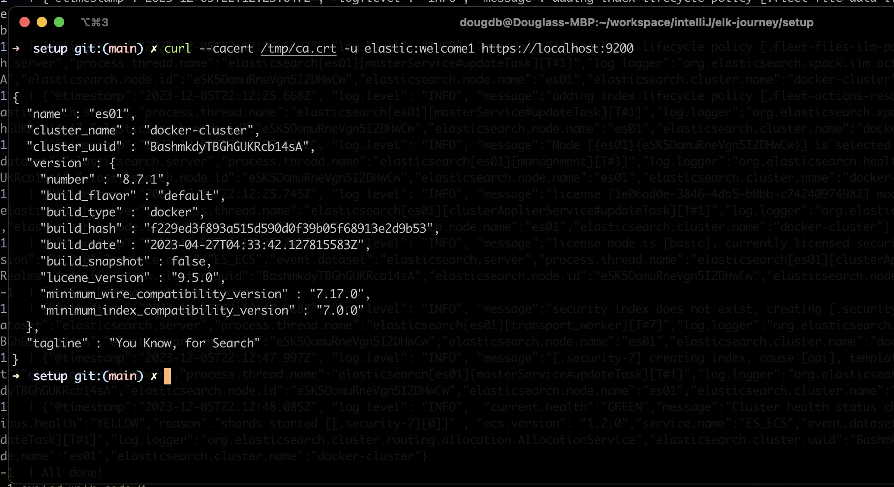
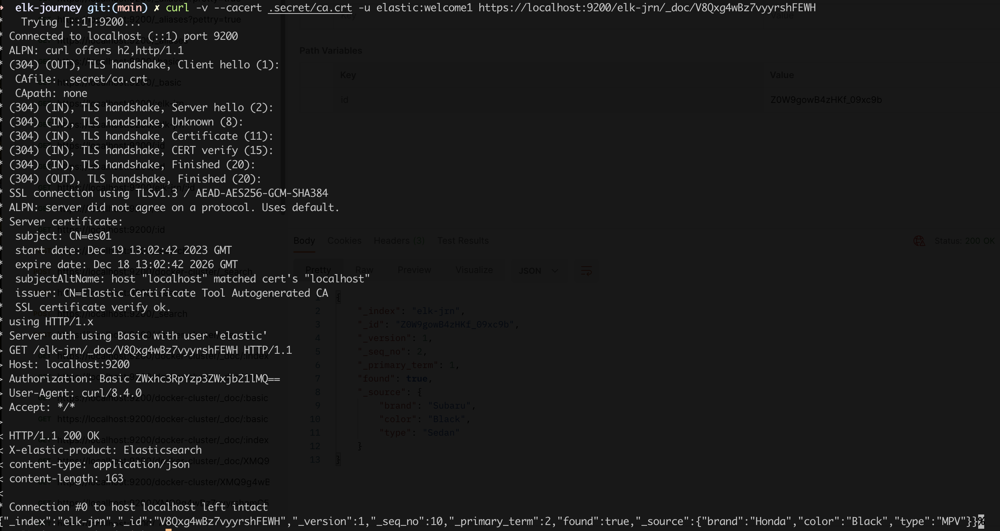
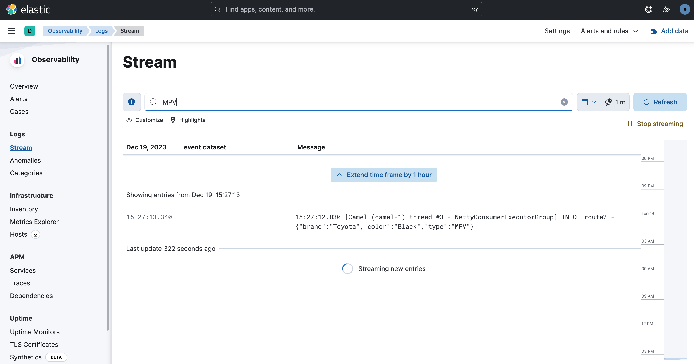

= Elastic Stack 8 Journeys

== Links

- https://www.elastic.co/blog/getting-started-with-the-elastic-stack-and-docker-compose[Elastic Stack]

- https://github.com/elkninja/elastic-stack-docker-part-one/tree/main[ELK Docker Compose]

- https://github.com/codingexplained/data-processing-with-logstash/tree/master[Github Course]

- https://github.com/codingexplained/data-processing-with-logstash[Data Processing with logstash Github]

- https://gist.github.com/isweluiz/ce26c0cd14e6d9b630697ccb4c703241[Logstash Configuration]

- https://github.com/logstash-plugins/logstash-patterns-core/tree/main/patterns/ecs-v1[Logstash Grok patterns]

== Install Guide with Docker compose

* As the Elastic Stack has grown over the years and the feature sets have increased, so has the complexity of getting started or attempting a proof-of-concept (POC) locally, while Elastic Cloud is still the fastest and easiest way to get started with Elastic, the need for local development and testing is still widely abundant, we’ll dive into configuring the components of a standard Elastic Stack consisting of Elasticsearch, Logstash, Kibana, and Beats (ELK-B), on which we can immediately begin developing, Filebeat, Metricbeat, and Logstash will all need additional configuration from yml files. see docker-compose.yml file

* The setup container will start up first, wait for the ES01 container to come online, all the certificates to the “certs” volume so that all other containers can have access to them

.ES01-Node Test communication
[souce,bash]
----
docker cp setup-es01-1:/usr/share/elasticsearch/config/certs/ca/ca.crt ../.secret/ca.crt

# project folder
curl -v --cacert ../.secret/ca.crt -u elastic:welcome1 https://localhost:9200

# any folder with cp to tmp folder
curl --cacert /tmp/ca.crt -u elastic:welcome1 https://localhost:9200

curl -v --cacert ../../.secret/ca.crt -u elastic:welcome1 https://localhost:9200/_count

curl -v --cacert ../../.secret/ca.crt -u elastic:welcome1 https://localhost:9200/_doc?elk-jrn=V8Qxg4wBz7vyyrshFEWH
----

* ELK Local Links

- http://localhost:5601/login?next=%2Fapp%2Fmonitoring[App Monitoring]
- http://localhost:5601/login?next=%2Fapp%2Flogs%2Fstream[Filebeat Stream]

* What is Elasticsearch

* What is Logstash

. Is an _Open Source_ processing engine responsible for receiving processing and shipping events, we can manipulate the data, cleaning or enriching data

* What is FileBeat

== Grok Parsing

* Sample of expression

`John Doe john@doe.com 32`

[source,html]
----
%{WORD:first_name} %{WORD:last_name} %{EMAILADDRESS:email} %{INT:age}
----

.Curl to Rest
[source,bash]
----
curl -v -X GET -H "Content-type: application/json"  http://localhost:12666/api/car/v1/random

https://localhost:9200/elk-jrn/_doc/:id

curl -v --cacert .secret/ca.crt -u elastic:welcome1 https://localhost:9200/elk-jrn/_doc/V8Qxg4wBz7vyyrshFEWH
----

.cUrl Result By Index Name on Doc

.Kibana Search by Stream

.Apply Grok patterns
[source,html]
----
input {
	file {
		path => "/path/to/logstash/event-data/apache_*.log"
		start_position => "beginning"
	}

	http {

	}
}

filter {
	if [headers][request_path] =~ "error" or [path] =~ "errors" {
		mutate {
			replace => { type => "error" }
		}
	} else {
		mutate {
			replace => { type => "access" }
		}

		grok {
			match => { "message" => '%{HTTPD_COMMONLOG} "%{GREEDYDATA:referrer}" "%{GREEDYDATA:agent}"' }
		}

		if "_grokparsefailure" in [tags] {
			drop { }
		}

		useragent {
			source => "agent"
			target => "ua"
		}

		# Admin pages
		if [request] =~ /^\/admin\// {
			drop { }
		}

		# Static files
		if [request] =~ /^\/js\//
			or [request] =~ /^\/css\//
			or [request] in ["/robots.txt", "/favicon.ico"] {
			drop { }
		}

		# Crawlers
		if [ua][device] == "Spider" {
			drop { }
		}

		mutate {
			convert => {
				"response" => "integer"
				"bytes" => "integer"
			}
		}

		date {
			match => [ "timestamp", "dd/MMM/yyyy:HH:mm:ss Z" ]
			remove_field => [ "timestamp" ]
		}

		geoip {
			source => "clientip"
		}
	}

	mutate {
		remove_field => [ "headers", "@version", "host" ]
	}
}

# Only dev purpose
output {
	stdout {
		codec => rubydebug
	}

	file {
		path => "%{type}_%{+yyyy_MM_dd}.log"
	}
}
----

.Kibana Events
[source,html]
----
input {
	file {
		path => "/path/to/logstash/event-data/apache_*.log"
		start_position => "beginning"
	}

	file {
		path => "/path/to/logstash/event-data/java_errors.log"
		start_position => "beginning"

		codec => multiline {
			pattern => "^%{CATALINA_DATESTAMP}"
			negate => true
			what => "previous"
			auto_flush_interval => 5
		}
	}
}

filter {
	if [headers][request_path] =~ "error" or [path] =~ "errors" {
		mutate {
			replace => { type => "error" }
		}
	} else {
		mutate {
			replace => { type => "access" }
		}

		grok {
			match => { "message" => '%{HTTPD_COMMONLOG} "%{GREEDYDATA:referrer}" "%{GREEDYDATA:agent}"' }
		}

		if "_grokparsefailure" in [tags] {
			drop { }
		}

		useragent {
			source => "agent"
			target => "ua"
		}

		# Admin pages
		if [request] =~ /^\/admin\// {
			drop { }
		}

		# Static files
		if [request] =~ /^\/js\//
			or [request] =~ /^\/css\//
			or [request] in ["/robots.txt", "/favicon.ico"] {
			drop { }
		}

		# Crawlers
		if [ua][device] == "Spider" {
			drop { }
		}

		mutate {
			convert => {
				"response" => "integer"
				"bytes" => "integer"
			}
		}

		date {
			match => [ "timestamp", "dd/MMM/yyyy:HH:mm:ss Z" ]
			remove_field => [ "timestamp" ]
		}

		geoip {
			source => "clientip"
		}
	}

	mutate {
		remove_field => [ "headers", "@version", "host" ]
	}
}

output {
	if [type] == "access" {
		elasticsearch {
			hosts => ["localhost:9200"]
			document_type => "default"
			#index => "%{type}-%{+YYYY.MM.dd}"
			http_compression => true
		}
	} else {
		stdout {
			codec => rubydebug
		}
	}
}
----

.Multiline Events in Error stack
[source,html]
----
input {
	file {
		path => "/path/to/logstash/event-data/apache_*.log"
		start_position => "beginning"
	}

	file {
		path => "/path/to/logstash/event-data/java_errors.log"
		start_position => "beginning"

		codec => multiline {
			pattern => "^(\s+|\t)|(Caused by:)"
			what => "previous"
			auto_flush_interval => 5
   		}
	}
}

filter {
	if [headers][request_path] =~ "error" or [path] =~ "errors" {
		mutate {
			replace => { type => "error" }
		}
	} else {
		mutate {
			replace => { type => "access" }
		}

		grok {
			match => { "message" => '%{HTTPD_COMMONLOG} "%{GREEDYDATA:referrer}" "%{GREEDYDATA:agent}"' }
		}

		if "_grokparsefailure" in [tags] {
			drop { }
		}

		useragent {
			source => "agent"
			target => "ua"
		}

		# Admin pages
		if [request] =~ /^\/admin\// {
			drop { }
		}

		# Static files
		if [request] =~ /^\/js\//
			or [request] =~ /^\/css\//
			or [request] in ["/robots.txt", "/favicon.ico"] {
			drop { }
		}

		# Crawlers
		if [ua][device] == "Spider" {
			drop { }
		}

		mutate {
			convert => {
				"response" => "integer"
				"bytes" => "integer"
			}
		}

		date {
			match => [ "timestamp", "dd/MMM/yyyy:HH:mm:ss Z" ]
			remove_field => [ "timestamp" ]
		}

		geoip {
			source => "clientip"
		}
	}

	mutate {
		remove_field => [ "headers", "@version", "host" ]
	}
}

output {
	if [type] == "access" {
		elasticsearch {
			hosts => ["localhost:9200"]
			document_type => "default"
			#index => "%{type}-%{+YYYY.MM.dd}"
			http_compression => true
		}
	} else {
		stdout {
			codec => rubydebug
		}
	}
}
----